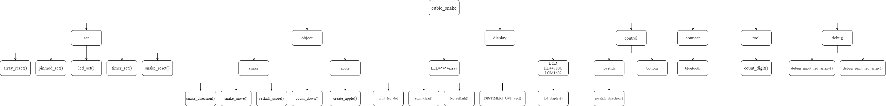
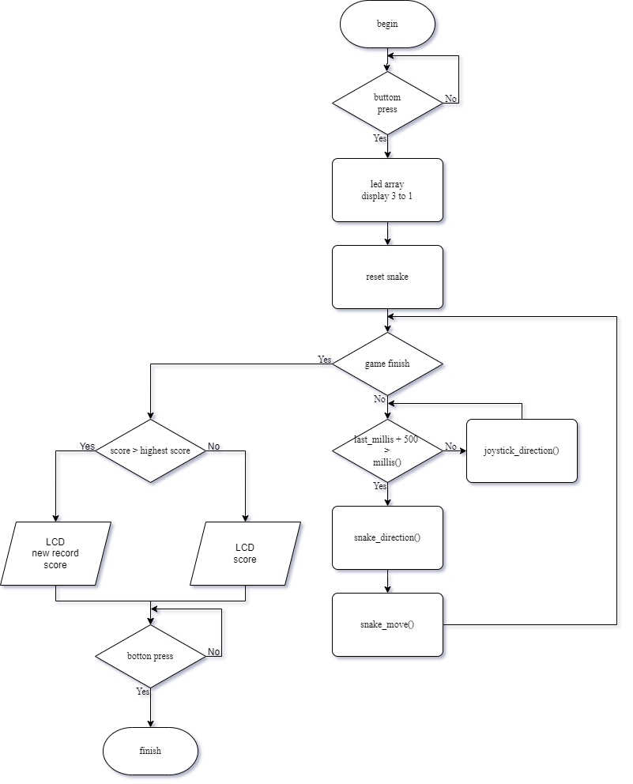
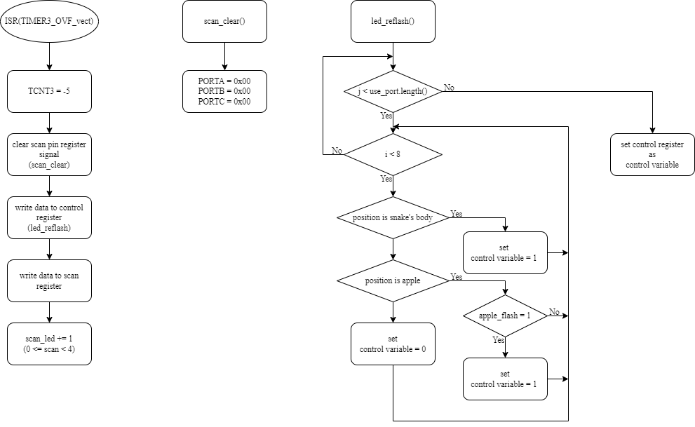
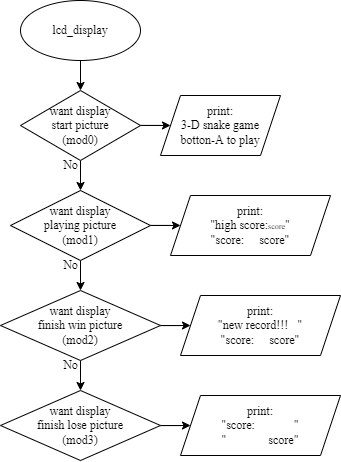

# 5x5x5 LED Cubic Snake

以 **5 x 5 x 5 LED Cube** 呈現的立體貪食蛇遊戲。Arduino 負責遊戲邏輯、LED 分層掃描、搖桿輸入、LCD 狀態顯示與 EEPROM 最高分保存；專案亦包含主控板與 LED Cube 的 Altium Designer 設計檔。

## 遊戲特色

- 125 顆 LED 組成三維遊戲場景。
- 以雙軸搖桿控制蛇在前、後、左、右、上、下六個方向移動。
- 開始畫面可選擇 `easy`、`normal`、`hard` 三種速度。
- 16 x 2 I2C LCD 顯示遊戲狀態、分數與最高紀錄。
- 各難度的最高分分別寫入 EEPROM。
- 遊戲中蘋果與蛇頭具有閃爍效果。
- 遊戲區採循環邊界：蛇從一側越界後會由相對側出現，撞到自身才會結束遊戲。

## 操作方式

1. 開機後，LCD 顯示遊戲標題與操作提示。
2. 在開始畫面移動搖桿選擇難度：

| 難度 | 每步移動間隔 | EEPROM 最高分位址 |
| --- | ---: | ---: |
| Easy | `1200 ms` | `0` |
| Normal | `1000 ms` | `1` |
| Hard | `600 ms` | `2` |

3. 按下 Button 1 開始遊戲，LED Cube 顯示 `3`、`2`、`1` 倒數。
4. 以搖桿改變行進方向，吃到閃爍的蘋果後蛇身加長且分數增加。
5. 當蛇頭碰撞蛇身時本局結束。
6. 若分數高於目前難度的最高紀錄，LCD 顯示 `new record!!!!` 並更新 EEPROM；否則顯示分數與最高紀錄。
7. 再次按下 Button 1 可進入下一局。

## 硬體需求

程式直接使用 Arduino Mega 等級 AVR 控制器提供的多組 Port 與 16-bit Timer，因此以 **Arduino Mega 2560** 或腳位/暫存器相容的控制板為目標。

| 模組 | 說明 |
| --- | --- |
| Arduino Mega 相容控制器 | 執行韌體與驅動顯示掃描 |
| 5 x 5 x 5 LED Cube | 遊戲畫面輸出 |
| 16 x 2 I2C LCD | 程式設定位址為 `0x3F` |
| 雙軸搖桿與遊戲按鈕 | 選擇難度、控制移動及開始遊戲 |
| 主控制板與 LED Cube PCB | Altium 專案已包含於倉庫 |

### 韌體腳位與輸出

| 功能 | 設定 |
| --- | --- |
| Button 1 / 開始按鈕 | Digital pin `8` |
| Button 2 | Digital pin `9` |
| 搖桿 X 軸 | `A6` |
| 搖桿 Y 軸 | `A7` |
| 外部中斷輸入 | Digital pin `19` |
| LCD | I2C，位址 `0x3F`，`16 x 2` |
| LED 欄輸出 | `PORTF`、`PORTB`、`PORTL`、`PORTC`、`PORTA` |
| LED 層選擇 | `PORTK` |

實際接線與焊接配置應以 `PCB/` 內的原理圖及 PCB 文件為準。

## 韌體設計

主程式位於 [`main_code/snake/snake.ino`](main_code/snake/snake.ino)。

### 遊戲流程

| 函式 | 功能 |
| --- | --- |
| `loop()` | 選擇難度、啟動一局、執行移動迴圈、判斷紀錄 |
| `snake_reset()` | 建立初始長度為 3 的蛇 |
| `apple_create()` | 產生不與蛇身重疊的新蘋果 |
| `joystick_direction()` | 以起始中心值和 `300` 的門檻判斷搖桿輸入 |
| `snake_direction()` | 將二維搖桿輸入轉換為三維方向改變 |
| `snake_move()` | 更新蛇頭位置並處理循環邊界 |
| `snake_hit()` | 處理吃蘋果及自撞結束 |
| `lcd_display()` | 顯示開始、遊玩、新紀錄及結束畫面 |

### LED 顯示與 Timer

顯示資料儲存在 `matrix[4][5][5][5]`：

- `matrix[0]`：遊戲畫面。
- `matrix[1]`、`matrix[2]`、`matrix[3]`：開始前倒數圖形。

| 中斷 | 用途 |
| --- | --- |
| `TIMER1_OVF_vect` | 逐層掃描 5 x 5 x 5 LED Cube |
| `TIMER3_OVF_vect` | 切換蘋果顯示狀態，形成閃爍效果 |
| `TIMER4_OVF_vect` | 切換蛇頭顯示狀態，形成閃爍效果 |
| `TIMER5_OVF_vect` | 非遊戲狀態下的隨機 LED 動畫 |

序列埠以 `115200` baud 輸出除錯資訊，包括選擇的移動間隔與遊戲矩陣狀態。

## 軟體需求

- [Arduino IDE](https://www.arduino.cc/en/software)
- [Altium Designer](https://www.altium.com/)：查看與編輯 PCB / 原理圖
- [draw.io](https://www.drawio.com/)：編輯流程圖原始檔
- [Laserbox](https://www.makeblock.com/laserbox)：專題外殼雷切加工工具

### Arduino 函式庫

最新版 `snake.ino` 引用以下函式庫：

| 函式庫 | 用途 |
| --- | --- |
| `LinkedList` | 儲存蛇身 X、Y、Z 座標 |
| `LiquidCrystal_I2C` | 控制 I2C LCD |
| `EEPROM` | 保存三種難度的最高分 |
| `Wire` | I2C 通訊 |

`EEPROM` 與 `Wire` 隨 Arduino 核心提供。倉庫內含 `main_code/snake/LinkedList-master.zip`，可在 Arduino IDE 使用 **Sketch > Include Library > Add .ZIP Library...** 匯入。

注意：資料夾中仍保留舊版本的 `LiquidCrystal_PCF8574-master.zip`，但最新版韌體已改用 `LiquidCrystal_I2C.h`，需另外安裝相容的 `LiquidCrystal_I2C` library。

## 編譯與上傳

1. 安裝 Arduino IDE，並連接 Arduino Mega 相容控制板。
2. 安裝 `LinkedList` 與 `LiquidCrystal_I2C` 函式庫。
3. 開啟 `main_code/snake/snake.ino`。
4. 在 Arduino IDE 選擇對應的 Mega 板型與序列埠。
5. 依 PCB 設計接上 LED Cube、LCD 與搖桿後編譯並上傳。
6. 開啟 Serial Monitor 並設為 `115200` baud，以觀察測試輸出。

## 專案結構

```text
.
|-- README.md
|-- main_code/
|   |-- snake/
|   |   |-- snake.ino                         # Arduino 韌體
|   |   |-- LinkedList-master.zip             # 目前使用的第三方函式庫
|   |   `-- LiquidCrystal_PCF8574-master.zip  # 舊 LCD 函式庫封存檔
|   `-- document/
|       |-- draw/                             # draw.io 設計圖原始檔
|       `-- png/                              # 匯出的流程圖及腳位圖
`-- PCB/
    |-- Main/                                 # 主控制板設計
    `-- LedCube/                              # LED Cube 板件設計
```

## 設計文件

### 流程圖與腳位圖

| 文件 | 預覽 |
| --- | --- |
| 系統架構 |  |
| 主迴圈流程 |  |
| LED 陣列顯示 |  |
| LCD 顯示 |  |
| 腳位設計 | [pin_design.png](main_code/document/png/pin_design.png) |

可編輯版本位於 `main_code/document/draw/`。

### PCB 專案入口

| 區塊 | Altium 專案檔 |
| --- | --- |
| 主控制板 | `PCB/Main/PCB_Project_444LED/PCB_Project_bjt.PrjPcb` |
| LED Cube | `PCB/LedCube/PCB_Project_444LED/PCB_Project_cubic.PrjPcb` |

## 程式注意事項

- `lcd_display()` 的結束畫面條件目前寫為 `else if(mod = 3)`；若要嚴格判斷模式，應改為比較運算式。
- 函式宣告區的 `void lcd_display();` 與後方 `void lcd_display(byte mod)` 介面不一致；若編譯失敗，需先統一函式宣告。
- `interrupt_pin` 對應的 `debug_timer_change()` 目前函式內容已註解，外部中斷不會改變顯示行為。
- `Button 2` 已設定為輸入，但目前遊戲流程尚未使用。
